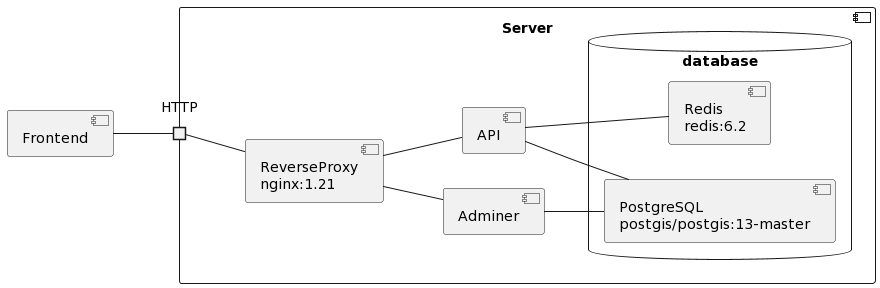
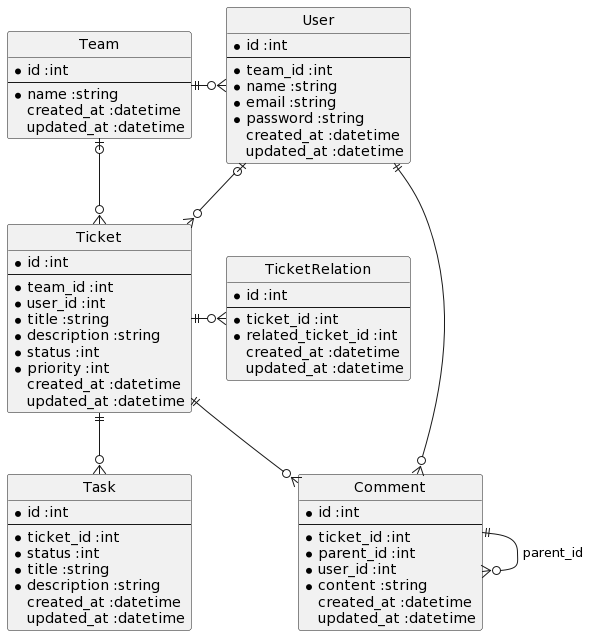

# Tick & SAAS

Tick & SAAS est une application web qui permet de gérer des tickets de support pour la gestion des incidents dans les projets de développement. L'application utilise une architecture basée sur Docker pour gérer plusieurs services, notamment une interface frontend, une API GraphQL, une base de données PostgreSQL, et un outil d'administration de base de données. Les utilisateurs peuvent créer, modifier et suivre des tickets, ainsi que commenter et ajouter des tâches aux tickets.

## Initialisation du projet

1. Copier le fichier `.env.example` en `.env` à la racine du projet et dans le dossier `api` :

```sh
cp .env.example .env
cp api/.env.example api/.env
```
2. Exécuter la commande suivante pour construire et démarrer les conteneurs Docker :

```sh
docker-compose up --build
```

## Accéder aux différents services

- Frontend : [http://localhost](http://localhost)
- API GraphQL : [http://api.localhost](http://api.localhost)
- Adminer : [http://adminer.localhost](http://adminer.localhost)



## Base de données

La base de données PostgreSQL est initialisée avec le fichier `init.sql` contenant des données générées aléatoirement selon le schéma de base de données.


